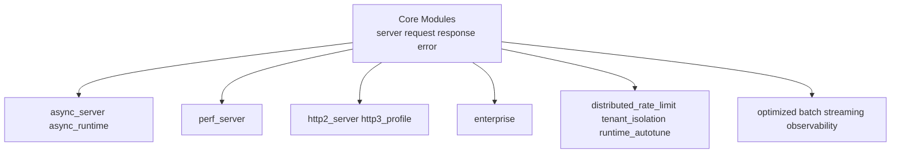
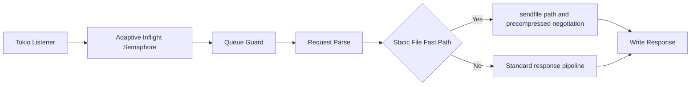
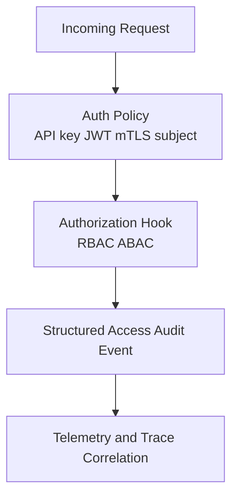
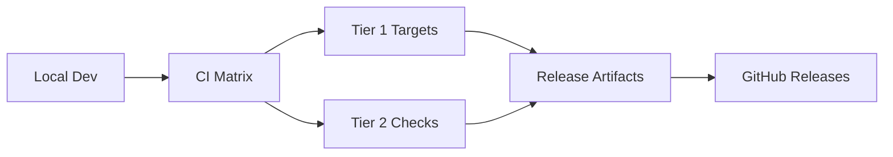

# Architecture Diagrams

Use this page to understand request flow, module boundaries, and feature layering.

## Request Lifecycle

What you get:
- Clear separation between parsing, policy, and response generation.
- One request path for correctness and observability.

## Core and Feature Modules

Interpretation:
- Core modules own baseline behavior.
- Feature-gated modules extend capability without forcing runtime cost when disabled.

## High-Performance Path

Operational effect:
- Backpressure limits protect latency under load.
- Fast-path serving avoids expensive work for common static requests.

## Enterprise Policy Layer

Design goal:
- Enforce policy at the edge of request handling.
- Produce auditable events with consistent request context.

## Portability and Release Pipeline

Delivery goal:
- Validate behavior on macOS, Linux, and Windows targets.
- Produce reproducible binaries and container artifacts.
